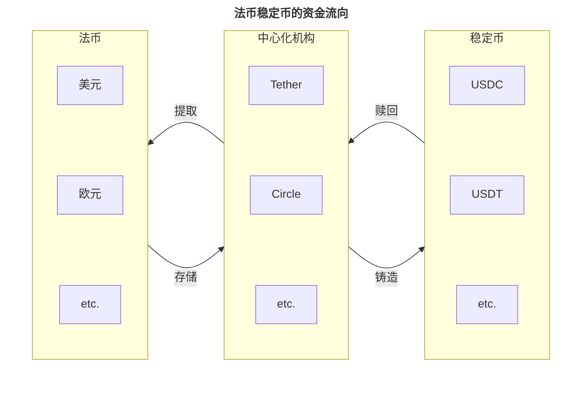

```mermaid
flowchart RL
  subgraph title["`**法币稳定币的资金流向**`"]
    direction RL
    subgraph fiat[法币]
      direction TB
      美元 ~~~ 欧元 ~~~ C[etc.]
    end
    subgraph institution[中心化机构]
      direction TB
      Tether ~~~ Circle ~~~ B[etc.]
    end
    subgraph stablecoin[稳定币]
      USDC ~~~ USDT ~~~ A[etc.]
    end
  end
  fiat --存储--> institution
  institution -- 提取 --> fiat
  institution --铸造--> stablecoin
  stablecoin --赎回--> institution
  style title fill:transparent,stroke:transparent
```