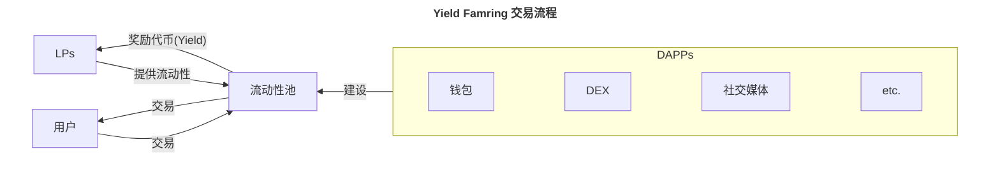

## 什么是 Yield Farming？

Yield Farming 可以理解为收益挖矿，它是借助 DeFi 金融工具来让自己的资产不断产生利息的过程。

通常来看，Yield Farming 的过程是流动性提供者（LPs）向流动池提供流动性，并且随着用户的交易而获得代币奖励的过程。

### 术语解释

Yield Faming 由 Yield 和 Farming 组成，理解这两个单词的意思可以帮助我们更好地理解这个术语本身。

- Yield 可以理解为收益/收益率，它是以百分比的形式，计算资产的存放所能带来的价值。
- Farming 可以理解为寻找投资机会的过程，它的目标是在风险承受范围内尽可能寻找高被动收益的机会。

Yield Farming 通常可以和 Liquidity Farming 混用，因为提供流动性（Liquidity）是获得 Yield 的主要方式。

## Yield Farming 有什么价值？

Yield Farming 能够提高资本利用效率，从而进一步促进 DeFi 的繁荣。具体来看，Yield Farming 涉及到三种身份：投资人、项目方和用户，我们可以将其视为三个角度，了解 Yield Farming 的价值。

- **投资人角度**：投资人，或者说流动性提供者，在向流动池提供流动性后，能够获得 LP tokens 作为奖励。这能够鼓励更多的投资人参与到流动池的提供中来。
- **项目方角度**：当越来越多的人参与流动性提供中以后，流动池的深度会增加，项目表现也会更好，从而吸引更多的用户使用。
- **用户角度**：流动池越深，用户交易时所产生的交易滑点就越低，使用体验也就会越好。

也就是说，Yield Farming 的出现能够成为市场激励的补充，对持有资产这件事本身进行激励，从而鼓励投资人将资产抵押/质押/提供到不同的协议中，进而促进市场的稳定和繁荣。

## 如何参与 Yield Farming？

### Yield Farming 的四种类型

1. **流动性提供**：LPs 可以向流动池提供两种不同的资产，并获得相应的证明，每当用户通过该流动池产生交易后，都能够获得该流动池的激励代币作为奖励。
2. **借贷**：借贷方可以将代币提供到借贷合约中，从而获得固定或者不固定的利率作为回报。
3. **借款**：借款本质上是一种杠杆，当借款方认为自己所持有的资产会上涨时，可以通过抵押该资产来获得稳定币，再利用这些稳定币从事其它金融活动，从而获得更高的收益。
4. **质押**：质押有两种形式。第一种是参与到 POS（权益证明）共识下区块链的质押当中，维护网络安全，从而获得可预期的回报。第二种就是流动性提供，它能够获得 LP tokens 作为质押证明，同时还能够通过质押 LP tokens（循环抵押）获得更进一步的收益。

### 参与流动性提供

Uniswap 和 SushiSwap 都提供了流动性池，用户可以向流动性池中存入对应的代币，来获得 LP tokens，从而获得该流动性池的激励代币作为收益。

### 参与借贷和借款

Aave 和 Compound 都提供了借贷和借款的服务。如果仅期望利用资产生息，那么借贷是相对安全的选择；但如果期望能在一个上涨的行情中获得更多的收益，可以通过抵押借款的方式获得更多的资金，从而放大收益。

### 参与质押

Lido 提供了质押 ETH 的服务，用户可以质押任意数量的 ETH 以获得相应的证明，从而在无需满足以太坊官方的 32 ETH 门槛的情况下，参与 POS 网络质押当中。

## Yield Farming 存在哪些风险？

### 无偿损失

无偿损失（impermanent loss）是指，流动性提供者向流动性池提供流动性后，由于市场价格的波动，所带来的暂时性损失。

举个例子：

假设 LP 最初向流动性池提供 1 个 ETH 和 10000 个 USDC，总价值为 20000 U。此时交易池的兑换比例是 1:10000，而市场价格也同样是 ETH:USDC = 1:10000。

随着时间推移，ETH:USDC 的市场价格变成了 1:1000，而交易池当中依然维持者 ETH:USDC = 1:10000 的兑换比例（理想下），那么市场当中的交易者就会利用这个交易池将 ETH 按照 10000 U 的价格兑换为 USDC，直到价格变为 ETH:USDC = 1:1000。

此时，如果 LP 再取出流动性，则会获得 10 个 ETH 和 1000 个 USDC，其总价值为 10 * 1000 + 1000 = 11000 U，比最初的 20000 U 减少了 9000 U，那么这 9000 U 就叫做无偿损失。

## 参考资料

1. 视频：[Buidler DAO 第四课视频](https://drive.google.com/file/d/1_5fTwWa-WXo93RR7WBibXegUqQJmD-SB/view)
2. 文章：[Yield Farming](https://metaschool.so/articles/yield-farming-meaning/)